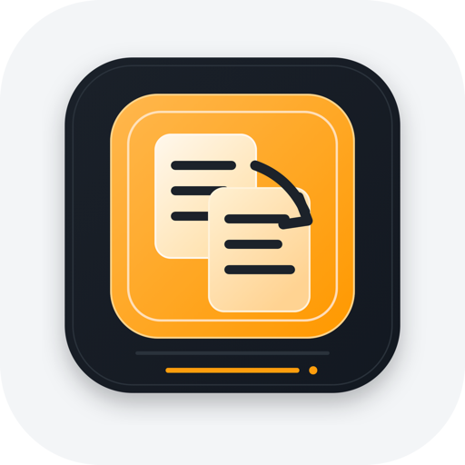

# ReContent

<p align="center">
  
</p>

ReContent 想解决的，不是“怎么再多写一篇内容”，而是“已经有了内容，怎么更快把它整理成真正能发出去的版本”。

很多创作者、运营和内容团队遇到的难点并不是没有素材，而是素材太散、太长、太原始。你可能已经有一篇文章、一段采访、一份播客逐字稿，或者只是一个值得利用的网页链接，但真正耗时间的，往往是把这些原始内容重新组织成适合某个平台发布的版本，还要兼顾语气、结构、长度和表达风格。

ReContent 就是围绕这件事设计的。它不是单纯帮你“润色一段文案”的 AI 输入框，而是把内容抽取、结构整理、平台适配、语气控制和生成回退串成一条更贴近真实工作流的链路，让原始素材更快变成一份可继续编辑、可直接发布的成稿。

当前版本已经开始体现出几个比较有代表性的产品亮点：

- 可以直接从文本或 URL 开始，把分散素材收拢成统一输入
- 面向具体平台生成，而不是只给出一段泛化改写结果
- 支持语气风格和个性化要求，让结果更接近“你想怎么说”
- 内置失败分类和保守模式 fallback，稳定性比一次性 prompt 调用更强
- 已经具备登录、工作区和 MySQL 认证能力，正在从 Demo 走向可持续迭代的产品原型
- 头像原图可安全直传私有 S3，并由独立 Lambda 异步压缩为标准 WebP

当前用户路径是：

`/` -> 根据登录状态重定向到 `/auth` 或 `/workspace`

进入工作区后，用户可以输入原文、选择一个目标平台、指定语气风格、补充个性化要求，然后生成一份适合当前平台的成稿。

## 当前版本概览

当前主干已经包含这些能力：

- 邮箱注册、登录、登出与会话维持
- 基于 MySQL 的 `users` / `sessions` 认证存储
- 受保护的 `/workspace` 内容重制工作台
- 两种输入模式：粘贴文本、输入 URL 自动抽取正文
- 三个目标平台：`Twitter / X`、`LinkedIn`、`小红书`
- 三种语气风格：`中性专业`、`正式商务`、`轻松口语`
- 最多 300 字的个性化要求输入
- Prompt 注入风险词拦截与输入校验
- 失败分类、重试决策、保守模式 fallback
- URL 抽取失败时的可解释错误提示
- 基础的 GitHub Actions CI / CD 与 AWS 部署链路
- 私有 S3 头像上传，以及 Lambda + SQS 的异步图片处理基础设施

和旧版本相比，当前项目最重要的变化有两点：

1. 现在已经不是匿名单页工具，而是登录后进入工作区的受保护应用。
2. 当前前端交互是“每次只生成 1 个平台版本”，而不是一次多选多个平台同时生成。

## 当前信息架构

### 路由

- `/`
  - 检查当前会话，已登录跳到 `/workspace`，未登录跳到 `/auth`
- `/auth`
  - 登录 / 注册入口
  - 如果认证数据库或会话密钥不可用，会显示配置不可用提示
- `/workspace`
  - 登录后的内容重制工作台
- `/api/auth/login`
- `/api/auth/register`
- `/api/auth/logout`
- `/api/repurpose`
- `/api/health`

### 当前主流程

```text
注册/登录
  -> 进入 workspace
  -> 输入文本或 URL
  -> 选择 1 个目标平台
  -> 选择语气风格
  -> 可选填写个性化要求
  -> 调用 /api/repurpose
  -> 展示单平台成稿
  -> 复制内容或继续人工分发
```

## 已实现功能

### 1. 认证与工作区

当前版本已经接入基于 MySQL 的认证能力：

- 邮箱注册
- 邮箱登录
- 服务端 session cookie
- 登出清理
- 受保护工作区路由

当认证数据库、`DATABASE_URL` / `MYSQL_*` 或 `AUTH_SESSION_SECRET` 配置缺失时，`/auth` 和 `/workspace` 都会进入“认证服务暂时不可用”的兜底页面，而不是直接报未处理异常。

认证相关代码主要在：

- [app/api/auth](/Users/juice/Desktop/vibe%20coding/ReContent-readme-current/app/api/auth)
- [app/lib/auth](/Users/juice/Desktop/vibe%20coding/ReContent-readme-current/app/lib/auth)
- [docs/auth/mysql-auth-setup.md](/Users/juice/Desktop/vibe%20coding/ReContent-readme-current/docs/auth/mysql-auth-setup.md)

### 2. 内容重制工作台

当前 workspace 是登录后的主页面，特点是：

- 支持文本输入和 URL 输入两种模式
- 每次只处理 1 个平台，优先保证稳定性
- 结果区按当前平台展示成稿
- 支持复制

这条链路主要由这些文件组成：

- [app/workspace/workspace-client.tsx](/Users/juice/Desktop/vibe%20coding/ReContent-readme-current/app/workspace/workspace-client.tsx)
- [app/components/recontent/input-panel.tsx](/Users/juice/Desktop/vibe%20coding/ReContent-readme-current/app/components/recontent/input-panel.tsx)
- [app/components/recontent/result-surface.tsx](/Users/juice/Desktop/vibe%20coding/ReContent-readme-current/app/components/recontent/result-surface.tsx)
- [app/components/recontent/result-document.tsx](/Users/juice/Desktop/vibe%20coding/ReContent-readme-current/app/components/recontent/result-document.tsx)

### 3. URL 内容抽取

`/api/repurpose` 支持在 URL 模式下抓取正文内容，然后把提取结果送入生成链路。

当前实现已经包含：

- 非法 URL 校验
- 网络异常、超时、HTTP 错误分类
- 无正文内容时的显式失败
- 面向用户的错误标题和错误详情
- URL 抽取测试与回归测试

相关文件：

- [app/api/repurpose/content-extraction.ts](/Users/juice/Desktop/vibe%20coding/ReContent-readme-current/app/api/repurpose/content-extraction.ts)
- [app/components/recontent/extraction-error-dialog.tsx](/Users/juice/Desktop/vibe%20coding/ReContent-readme-current/app/components/recontent/extraction-error-dialog.tsx)

### 4. Prompt 构建与失败回退

当前生成逻辑不是“单次请求成功或失败”这么简单，而是已经有一层轻量的失败策略：

- normal mode 先尝试一次
- 根据失败结果做分类
- 必要时压缩个性化要求
- 切换到 conservative mode 再尝试
- 对 JSON 结构和平台格式做更严格约束

这部分是当前项目比较像“产品化内容生成器”的地方，而不只是一个大模型表单。

相关文件：

- [app/api/repurpose/route.ts](/Users/juice/Desktop/vibe%20coding/ReContent-readme-current/app/api/repurpose/route.ts)
- [app/api/repurpose/prompt-builder.ts](/Users/juice/Desktop/vibe%20coding/ReContent-readme-current/app/api/repurpose/prompt-builder.ts)
- [app/api/repurpose/failure-policy.ts](/Users/juice/Desktop/vibe%20coding/ReContent-readme-current/app/api/repurpose/failure-policy.ts)

## 目录结构

```text
app/
  api/
    auth/
      login/route.ts
      logout/route.ts
      register/route.ts
    health/route.ts
    repurpose/
      route.ts
      prompt-builder.ts
      failure-policy.ts
      content-extraction.ts
      kimi-client.ts
  auth/
    page.tsx
    auth-experience.tsx
  workspace/
    page.tsx
    workspace-client.tsx
  components/
    auth/
    recontent/
  lib/
    auth/
docs/
  auth/
.github/workflows/
  ci.yml
  deploy.yml
infra/
  terraform/
```

## 技术栈

- `Next.js 16`
- `React 19`
- `TypeScript`
- `Tailwind CSS`
- `OpenAI SDK`
- 自定义 `Kimi` 客户端
- `mysql2`
- `AWS Lambda + S3 + SQS + SNS`
- `sharp`
- `Vitest`
- `OpenNext + Cloudflare`
- `Wrangler`
- `Docker`
- `GitHub Actions`

## 本地启动

### 1. 安装依赖

```bash
npm install
```

### 2. 配置环境变量

最小本地开发配置示例：

```bash
OPENAI_API_KEY=sk-xxxxx
KIMI_API_KEY=your-kimi-key
OPENAI_MODEL=gpt-4.1-mini
KIMI_MODEL=kimi-k3
AUTH_SESSION_SECRET=replace-with-a-long-random-secret
MYSQL_HOST=127.0.0.1
MYSQL_PORT=3306
MYSQL_USER=root
MYSQL_PASSWORD=your-password
MYSQL_DATABASE=recontent
```

可选：

```bash
FIRECRAWL_API_KEY=fc-xxxxx
# FIRECRAWL_API_URL=http://localhost:3002
MYSQL_SSL_MODE=required
MYSQL_SSL_CA_PATH=/path/to/ca.pem
```

说明：

- 配置 `KIMI_API_KEY` 时，后端优先使用 Kimi
- 未配置 Kimi、但配置了 `OPENAI_API_KEY` 时，会走 OpenAI
- 两者都不配时，会回退到本地 `mock`
- 如果启用认证能力，必须同时保证数据库配置和 `AUTH_SESSION_SECRET` 可用
- MySQL 详细配置见 [docs/auth/mysql-auth-setup.md](/Users/juice/Desktop/vibe%20coding/ReContent-readme-current/docs/auth/mysql-auth-setup.md)

### 3. 初始化 MySQL 认证表

把下面这个 schema 执行到你的 MySQL 数据库：

- [docs/auth/mysql-auth-schema.sql](/Users/juice/Desktop/vibe%20coding/ReContent-readme-current/docs/auth/mysql-auth-schema.sql)

### 4. 启动开发环境

```bash
npm run dev
```

默认访问：

- [http://localhost:3000](http://localhost:3000)

## 常用命令

```bash
npm run dev
npm run build
npm run start
npm run lint
npm run preview
npm run deploy
npm run upload
npm run cf-typegen
npm run verify:avatar-lambda
```

说明：

- `preview` / `deploy` / `upload` 走的是 OpenNext + Cloudflare 这条构建链路
- 当前仓库同时保留了 AWS ECS 方向的部署配置与文档，实际生产部署前请先确认你要走哪条路线
- `verify:avatar-lambda` 只读检查头像 Lambda、S3、SQS、IAM 和告警配置；部署步骤见 [docs/auth/avatar-lambda-deployment.md](docs/auth/avatar-lambda-deployment.md)

## 测试与验证

### 认证相关

```bash
npx vitest run \
  app/lib/auth/session.test.ts \
  app/api/auth/login/route.test.ts \
  app/api/auth/register/route.test.ts
```

### 内容重制主链路

```bash
npx vitest run app/api/repurpose/*.test.ts
```

### URL 抽取回归

```bash
npm run test:extraction:fixtures
```

### 生产构建

```bash
npm run build
```

## DevOps / CI/CD 流程

当前仓库里已经有一条从代码提交到 ECS 发布的基础流水线，但成熟度还属于“最小可用”阶段。

### 1. 代码协作入口

日常开发默认通过分支和 PR 进入主干：

- 开发者在功能分支或独立 worktree 中完成改动
- 向 `main` 发起 PR
- GitHub Actions 在 PR 上先跑 CI
- CI 通过后再合并到 `main`
- 合并到 `main` 后触发 deploy workflow

这个协作约定和仓库里的 [AGENTS.md](/Users/juice/Desktop/vibe%20coding/ReContent-readme-current/AGENTS.md) 是一致的。

### 2. CI 做什么

当前仓库已经有基础的 GitHub Actions CI：

- 触发条件
  - `pull_request` 到 `main`
  - `push` 到 `main`
  - 纯文档改动会改走轻量 docs workflow，不进入重型 CI
- 执行内容
  - `npm ci`
  - `npm run lint`
  - `npx vitest run` 执行内容、认证、头像、页面和 preflight 的聚焦测试
  - 安装并测试独立的 `lambda/avatar-processor` 包
  - 在 Amazon Linux 2023 容器中构建 Lambda ZIP
  - `npm run build`
  - `docker build -t recontent:ci .`

这意味着当前 CI 主要覆盖：

- 安装依赖是否稳定
- lint 是否通过
- 内容重制、认证、头像上传和主要页面行为是否通过
- Lambda 处理器类型、行为和 Linux 原生依赖是否可用
- Next.js 生产构建是否通过
- Docker 镜像是否至少能成功构建

但它现在还没有完整覆盖：

- 浏览器级端到端用户流程
- deploy 后 smoke test
- 真实 RDS、S3 和 Lambda 的线上连通性验证

相关文件：

- [.github/workflows/ci.yml](/Users/juice/Desktop/vibe%20coding/ReContent-readme-current/.github/workflows/ci.yml)

### 3. CD 做什么

当前 deploy workflow 负责把 `main` 上的代码发布到 AWS ECS。

触发条件：

- `push` 到 `main`
- 推送符合 `v*` 的 tag
- 手动 `workflow_dispatch`
- 仅当本次 push 包含可部署变更时，自动 deploy 才会运行；文档-only 合并不会触发 ECS 发布

执行顺序大致是：

1. checkout 仓库
2. setup Node.js 22
3. `npm ci`
4. `npm run build`
5. 通过 GitHub OIDC 假设 AWS deploy role
6. 登录 Amazon ECR
7. 构建 Docker 镜像
8. 打 tag
   - `sha-<8位commit>`
   - `latest`（仅 `main`）
   - `v*` release tag（如果本次是 tag 发布）
9. push 到 ECR
10. 读取当前 ECS service 正在使用的 task definition
11. 用新镜像渲染一个新的 task definition revision
12. 更新 ECS service
13. 等待 service stability

仓库里当前写死的部署目标是：

- AWS Region: `us-east-1`
- ECR repository: `recontent`
- ECS cluster: `default`
- ECS service: `recontent-b13f`
- ECS container name: `Main`

相关文件：

- [.github/workflows/docs.yml](/Users/juice/Desktop/vibe%20coding/ReContent-readme-current/.github/workflows/docs.yml)
- [.github/workflows/deploy.yml](/Users/juice/Desktop/vibe%20coding/ReContent-readme-current/.github/workflows/deploy.yml)

### 4. AWS 凭证怎么接进 CI/CD

当前部署不是在 GitHub 里存一套长期 AWS Access Key，而是走 OIDC：

- GitHub Actions 请求 OIDC token
- AWS IAM role `github-actions-recontent-deploy` 允许来自这个仓库 `main` 分支的 workflow 假设角色
- workflow 通过 `aws-actions/configure-aws-credentials` 获取短期凭证

这部分已经部分 IaC 化，见：

- [infra/terraform/iam.tf](/Users/juice/Desktop/vibe%20coding/ReContent-readme-current/infra/terraform/iam.tf)

### 5. Terraform 现在管到哪里

当前 `infra/terraform` 还是 bootstrap 阶段，不是全量基础设施管理。

已经纳入 Terraform 的只有：

- ECR repository `recontent`
- GitHub Actions deploy role `github-actions-recontent-deploy`

还没有纳入 Terraform 的重要资源包括：

- ECS service
- ECS task definition
- ALB / target groups / listener rules
- Secrets Manager
- CloudWatch alarms
- RDS / MySQL 相关资源
- Terraform remote backend

也就是说，现在的基础设施状态是“部分 IaC，部分手工/现网资源依赖”。

相关文件：

- [infra/terraform/README.md](/Users/juice/Desktop/vibe%20coding/ReContent-readme-current/infra/terraform/README.md)
- [infra/terraform/ecr.tf](/Users/juice/Desktop/vibe%20coding/ReContent-readme-current/infra/terraform/ecr.tf)
- [infra/terraform/iam.tf](/Users/juice/Desktop/vibe%20coding/ReContent-readme-current/infra/terraform/iam.tf)
- [infra/terraform/imports.tf](/Users/juice/Desktop/vibe%20coding/ReContent-readme-current/infra/terraform/imports.tf)

### 6. 当前发布链路的边界

当前这条 CI/CD 流水线已经能做到：

- PR 和主干提交自动校验
- Docker 镜像自动构建
- 镜像自动推送 ECR
- ECS service 自动滚动更新

但还没有做到：

- CI 成功后再强制允许 deploy 的严格 gate
- 更完整的测试覆盖
- deploy 前配置完整性深度校验
- deploy 后业务级 smoke test
- 完整 IaC 化
- 一键回滚和环境差异收敛

### 7. 一句话理解当前 DevOps 状态

如果用一句话概括现在的仓库状态：

`代码提交 -> GitHub Actions CI -> Docker build -> ECR push -> ECS rolling deploy`

这条主链路已经打通，但基础设施治理、测试覆盖和部署保护仍然有继续加强的空间。

## AWS / ECS / MySQL 备注

如果你准备把认证功能部署到 AWS ECS + RDS MySQL，当前代码的假设是：

- 运行时是 Node.js 服务，不是 Cloudflare Worker 直接连 MySQL
- `DATABASE_URL` 或 `MYSQL_*` 必须可用
- `AUTH_SESSION_SECRET` 必须可用
- Amazon RDS 主机名默认按 TLS 连接处理
- 非 RDS MySQL 若要求 TLS，需要明确提供 CA 配置

部署前建议先读：

- [docs/auth/mysql-auth-setup.md](/Users/juice/Desktop/vibe%20coding/ReContent-readme-current/docs/auth/mysql-auth-setup.md)

## 协作约定

如果你要继续在这个仓库里开发，请先看：

- [AGENTS.md](/Users/juice/Desktop/vibe%20coding/ReContent-readme-current/AGENTS.md)

这个文件定义了项目的默认协作方式，尤其是：

- 默认使用 `git worktree`
- 一项任务一个独立 worktree
- 提交前要做 review / 对抗性检查 / 验证

## 下一步比较自然的方向

- 完整补齐 auth + workspace 的 CI 覆盖
- 继续增强 URL 抽取稳定性
- 增加生成历史与工作区持久化
- 补更完整的部署 smoke test
- 明确 Cloudflare 与 ECS 哪条才是正式生产路线
- 扩展更多平台模板或品牌语气能力
